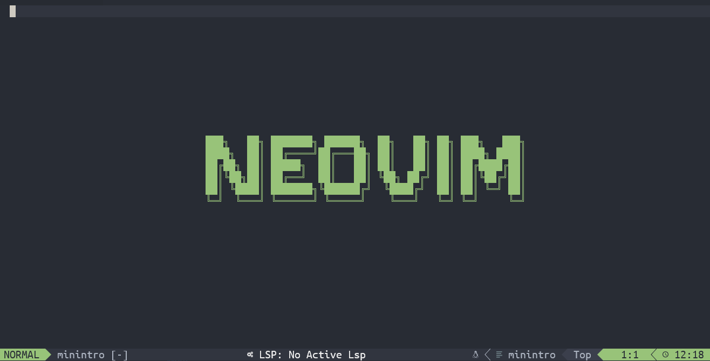
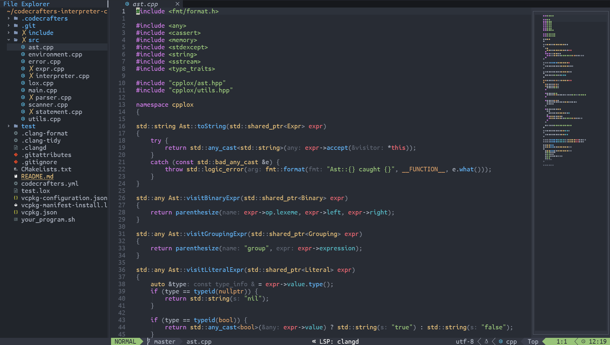

# Configure Neovim

You can follow the steps in this `README` file or read the blog [\[Start from scratch: Neovim\]](https://hangx-ma.github.io/2023/06/23/neovim-config.html) to configure Neovim.

<div class="dino" align="center">
  <table>
    <tr>
      <td>
      <td>
    </tr>
    <tr>
      <td align="center"><font size="2" color="#999"><u>Neovim: Statup Page</u></font></td>
      <td align="center"><font size="2" color="#999"><u>Neovim: Main Page</u></font></td>
    </tr>
  </table>
</div>

> [!NOTE]
> **_requirements.sh_** provides a convenient installation method. Run `./script/requirements.sh help` to see every flag.
>
> ```txt
> Usage:  [all|basic|component|migrate|sync|help]
>     all       - Install all packages
>     basic     - Install Neovim and the apt-level essentials
>     component - Install just the component you pick
>     migrate   - Deploy this repo's nvim config to $XDG_CONFIG_HOME/nvim
>                 (offline; never clones a remote dotfiles repo)
>     sync      - Refresh DEFAULT_*_VERSION pins from upstream
>     help      - Show this guidance
> ```
>
> ### One-shot setup on a fresh machine
>
> ```bash
> # Clone, then deploy config + install every dependency in a single step.
> # Use --xdg-base when $HOME has a quota; the script will write
> # XDG_CONFIG_HOME/XDG_DATA_HOME/XDG_STATE_HOME/XDG_CACHE_HOME to your
> # shell rc so the location persists across sessions.
> git clone https://github.com/HangX-Ma/dotfiles.git
> cd dotfiles/nvim
> ./script/requirements.sh migrate --with-deps --xdg-base="$WORKSPACE" -y
> ```
>
> `migrate` alone (without `--with-deps`) deploys just the config and is
> safe to re-run — the previous `~/.config/nvim` is moved aside to
> `~/.config/nvim.bak-<timestamp>` first.
>
> ### Interactive TUI
>
> ```bash
> ./script/requirements.sh setup       # or just `./script/requirements.sh`
> ```
>
> Opens a guided menu: pick a profile (quick / full / custom / config-only),
> XDG layout (default / `$WORKSPACE` / custom), and prefix. Uses
> `whiptail`/`dialog` if available; otherwise falls back to plain numbered
> prompts so it works on any POSIX machine.
>
> ### Download cache & sideloading
>
> All release tarballs are cached at
> `${XDG_CACHE_HOME:-$HOME/.cache}/nvim-installer/downloads/`. A second run
> with the same versions never touches the network.
>
> If a download is too slow (e.g. LLVM is ~800 MB), copy the file from a
> faster machine and drop it into the cache directory. The next run will
> reuse it. The script will print the exact filename and target path on
> failure.
>
> Parallel downloads via `aria2c` are used automatically when available
> (`requirements.sh basic` installs it as part of the apt essentials).

> [!WARNING]
> I have tested all modules in the script but it possibly has some tiny mistakes that I haven't found. Please inform me if you figure out issues.

## System Support(Recommended)

- clipboard

  ```bash
  cp script/clipboard-provider $HOME/clipboard-provider
  echo "export PATH=$HOME/clipboard-provider:$PATH" >> ~/.bashrc
  # support clipboard on WSL
  sudo apt-get install wl-clipboard
  # test clipboard-provider
  echo "test" | clipboard-provider copy
  ```

  > You can select your own clipboard support by looking at `:help clipboard-tool` in neovim.
  > Refer to this [page](https://zhuanlan.zhihu.com/p/419472307) to acquire more details.

## Update configuration files

- Move `nvim` folder into appropriate place or use the script to update configuration.

  ```bash
  git clone https://github.com/HangX-Ma/dotfiles.git
  mkdir ~/.config
  cp -r dotfiles/nvim ~/.config
  ```

- When you run `nvim`, **Lazy** package manager will install all neovim extensions automatically. You may encounter with some issues about a lack of dependencies. Just run the following command in neovim and follow the instructions provided by the **health report**.

  ```vim
  :checkhealth
  ```

## Layout

```text
nvim/
├── init.lua                Entry point; loads lazy, core options, autocmds and keymaps.
├── lua/
│   ├── lazy-init.lua       Bootstraps lazy.nvim and imports plugin specs.
│   ├── core/               Editor-level config, independent of any plugin.
│   │   ├── options.lua     vim.opt / vim.g settings.
│   │   ├── keybindings.lua Global keymaps + shared helper tables.
│   │   ├── autocmds.lua    Generic autocmds (yank highlight, LSP attach, etc.).
│   │   ├── handlers.lua    Shared LSP handlers / capabilities.
│   │   └── crisp.lua       Small utility helpers (notify, prequire, big-file check).
│   ├── lib/                Reusable Lua modules that are not plugin specs.
│   │   └── inactive_regions.lua  clangd `textDocument/inactiveRegions` renderer.
│   ├── syntax/             Hand-written syntax extensions for C/C++.
│   └── plugin/             Lazy.nvim plugin specs, grouped by responsibility.
│       ├── init.lua        Imports each subgroup below.
│       ├── ui/             Status/winbar/buffer line, notifications, dashboards,
│       │                   minimap, indent guides, symbol UI, which-key, etc.
│       ├── editor/         Text-editing behaviour: motions (flash, spider),
│       │                   pairs, comments, folds, todo/whitespace, doge, etc.
│       ├── finder/         Pickers and file/buffer browsers: fzf-lua,
│       │                   yazi, nvim-tree, arena.
│       ├── lsp/            LSP core (mason, lspconfig, cmp, lint, format,
│       │                   signature, inlay hints) plus per-server configs
│       │                   under `lsp/server/`.
│       ├── treesitter/     nvim-treesitter and treesitter-context.
│       ├── lang/           Language-specific tooling: rust, python, markdown.
│       ├── debug/          DAP and neotest.
│       ├── git/            gitsigns, diffview, lazygit.
│       ├── theme/          Colorschemes (one is enabled, others kept disabled).
│       └── tools/          Standalone utilities: toggleterm, cscope,
│                           icon-picker, hardtime.
├── after/ftplugin/         Per-filetype tweaks loaded after default ftplugins.
├── assets/                 Screenshots used by this README.
└── script/                 Install / requirements / clipboard helper scripts.
```

When adding a new plugin, drop the spec file into the subgroup that best
matches its **purpose** (UI vs. editing vs. finding vs. LSP …). Lazy.nvim
auto-discovers every `*.lua` under `lua/plugin/<group>/` because of the
`{ import = "plugin.<group>" }` entries in `lua/plugin/init.lua`.

Internal helpers that are *not* lazy specs (e.g. shared modules required by
several plugin files) belong in `lua/lib/` so lazy does not try to import
them as plugin specs.
