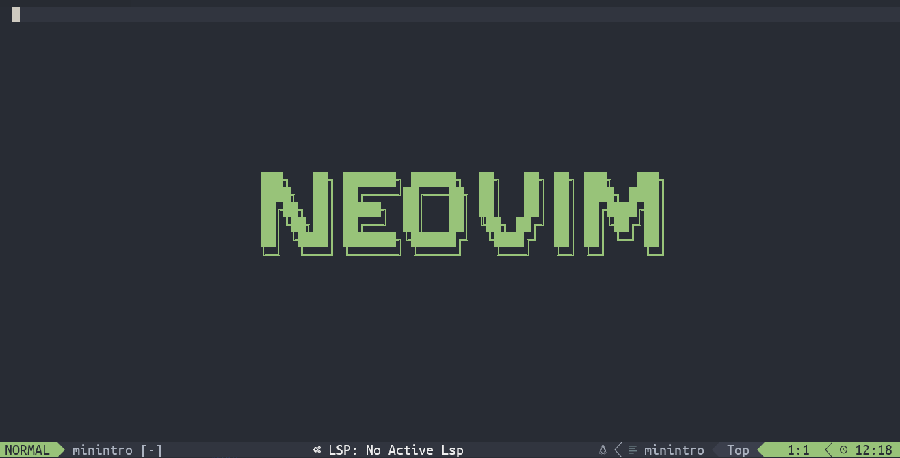
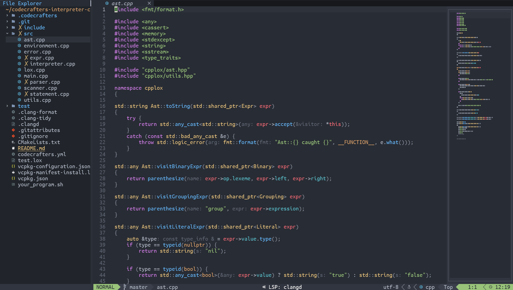

# Neovim Configuration

A modular Neovim (>= 0.12) setup managed by [lazy.nvim](https://github.com/folke/lazy.nvim):
LSP, treesitter, fuzzy finding, git, debugging and a curated UI, with a single
script that installs every dependency and deploys the config. For the story behind
it, see the blog [\[Start from scratch: Neovim\]](https://hangx-ma.github.io/2023/06/23/neovim-config.html).

<div class="dino" align="center">
  <table>
    <tr>
      <td>
      <td>
    </tr>
    <tr>
      <td align="center"><font size="2" color="#999"><u>Neovim: Statup Page</u></font></td>
      <td align="center"><font size="2" color="#999"><u>Neovim: Main Page</u></font></td>
    </tr>
  </table>
</div>

## Quick start

Everything is driven by `script/requirements.sh`. Clone the repo, then either run
the guided TUI or pick a one-shot command.

```bash
git clone https://github.com/HangX-Ma/dotfiles.git
cd dotfiles/nvim
./script/requirements.sh          # guided TUI (recommended)
```

The TUI walks you through a **profile** (quick / full / custom / config-only), an
**XDG layout** (default `$HOME` / `$WORKSPACE` / custom), a tool **prefix**, and a
deploy method (copy or symlink). Pass `-y` / `--prefix` / `--xdg-base` on the
command line to skip the matching prompt. It uses `whiptail`/`dialog` when
available and falls back to plain numbered prompts otherwise.

### One-shot commands

```bash
# Fresh machine: install every dependency AND deploy the config in one step.
# --xdg-base anchors XDG_CONFIG/DATA/STATE/CACHE under a chosen dir (handy when
# $HOME has a quota) and persists them to your shell rc.
./script/requirements.sh migrate --with-deps --xdg-base="$WORKSPACE" -y

# Deploy the config only (offline, no dependency installs). Safe to re-run:
# the previous ~/.config/nvim is moved to ~/.config/nvim.bak-<timestamp> first.
./script/requirements.sh migrate

# Symlink ~/.config/nvim to this repo so edits take effect immediately.
./script/requirements.sh migrate --symlink
```

## Script reference

Run `./script/requirements.sh help` for the full list. The operations:

| Operation   | What it does |
|-------------|--------------|
| `setup`     | Guided TUI: pick a profile + XDG layout, then install (default when no operation is given). |
| `all`       | Install every packaged tool, then deploy the config. |
| `basic`     | Install Neovim + the apt-level essentials, then deploy the config. |
| `component` | Menu to install just one component (bat, clang-tools, fd, lazygit, lua_ls, …). |
| `migrate`   | Deploy this repo's config to `$XDG_CONFIG_HOME/nvim` (offline; never clones a remote). |
| `sync`      | Refresh the pinned `DEFAULT_*_VERSION` values in the script from upstream. |
| `help`      | Show usage. |

Common options (see `help` for the rest):

| Option            | Applies to | Meaning |
|-------------------|------------|---------|
| `--prefix=PATH`   | installs   | Tool install path (default `$HOME/.local`). |
| `--arch=ARCH`     | installs   | `x86` (default) or `ARM64`. |
| `--with-deps`     | `migrate`  | Also install Neovim + tools before deploying the config. |
| `--xdg-base=DIR`  | `migrate`  | Anchor the XDG dirs under `DIR` and persist them to your shell rc. |
| `--symlink`       | `migrate`  | Symlink the config to this repo instead of copying. |
| `-y`              | all        | Auto-answer "yes" to sudo prompts. |

**Downloads & caching.** Release tarballs are cached under
`$XDG_CACHE_HOME/nvim-installer/downloads/` (default `~/.cache/...`), so a second
run with the same versions never hits the network. `aria2c` is used for parallel
downloads when present (installed by the apt essentials); `curl`/`wget` are the
fallback. On a slow link you can sideload a file by dropping it into the cache
directory — the script prints the exact target path on failure. Set
`GITHUB_TOKEN`/`GH_TOKEN` to raise the GitHub API rate limit.

> [!NOTE]
> After deploying, launch `nvim` once and **lazy.nvim** will install every plugin
> automatically. If something is missing, run `:checkhealth` inside Neovim and
> follow the health report.

> [!WARNING]
> Every module has been tested, but small issues may remain — please report
> anything you hit.

## Clipboard support (recommended)

```bash
cp script/clipboard-provider $HOME/clipboard-provider
echo "export PATH=$HOME/clipboard-provider:$PATH" >> ~/.bashrc
# WSL only
sudo apt-get install wl-clipboard
# test it
echo "test" | clipboard-provider copy
```

> The `clipboard` component of the script installs this shim for you. Pick your
> own provider via `:help clipboard-tool`; see this
> [page](https://zhuanlan.zhihu.com/p/419472307) for details.

## Layout

```text
nvim/
├── init.lua                Entry point; loads lazy-init, autocmds, keymaps, tmux capture and C/C++ syntax setup.
├── lua/
│   ├── lazy-init.lua       Bootstraps lazy.nvim and imports plugin specs.
│   ├── core/               Editor-level config, independent of any plugin.
│   │   ├── options.lua     vim.opt / vim.g settings.
│   │   ├── keybindings.lua Global keymaps + shared helper tables.
│   │   ├── autocmds.lua    Generic autocmds (yank highlight, LSP attach, etc.).
│   │   ├── node-path.lua   Pins a modern node on PATH before LSP servers spawn.
│   │   ├── tmux-capture.lua Capture tmux pane output into a buffer.
│   │   └── crisp.lua       Small utility helpers (notify, prequire, big-file check).
│   ├── lib/                Reusable Lua modules that are not plugin specs.
│   │   └── inactive_regions.lua  clangd `textDocument/inactiveRegions` renderer.
│   ├── syntax/             Hand-written syntax extensions for C/C++.
│   └── plugin/             Lazy.nvim plugin specs, grouped by responsibility.
│       ├── init.lua        Imports each subgroup below.
│       ├── ui/             Status/winbar/buffer line, notifications, dashboards,
│       │                   minimap, indent guides, symbol UI, which-key, etc.
│       ├── editor/         Text-editing behaviour: motions (flash, spider),
│       │                   pairs, comments, folds, todo/whitespace, doge, etc.
│       ├── finder/         Pickers and file/buffer browsers: fzf-lua,
│       │                   nvim-tree, arena.
│       ├── lsp/            LSP core (mason, lspconfig, cmp, lint, format,
│       │                   signature, inlay hints) plus per-server configs
│       │                   under `lsp/server/`.
│       ├── treesitter/     nvim-treesitter and treesitter-context.
│       ├── lang/           Language-specific tooling: rust, python, markdown, leetcode.
│       ├── debug/          DAP and neotest.
│       ├── git/            gitsigns, diffview, git-conflict, commit-lens.
│       ├── theme/          Colorschemes (one is enabled, others kept disabled).
│       └── tools/          Standalone utilities: toggleterm, cscope,
│                           icon-picker, hardtime, vim-slime.
├── plugins/                Repo-local (vendored) plugins loaded as lazy `dir` specs.
│   ├── commit-lens/        Blame-highlight lines belonging to chosen commits (+ tests).
│   └── virtcolumn/         Vendored virtcolumn.nvim with formatter-config column detection.
├── after/ftplugin/         Per-filetype tweaks loaded after default ftplugins.
├── assets/                 Screenshots used by this README.
└── script/                 Install / requirements / clipboard helper scripts.
```

When adding a new plugin, drop the spec file into the subgroup that best
matches its **purpose** (UI vs. editing vs. finding vs. LSP …). Lazy.nvim
auto-discovers every `*.lua` under `lua/plugin/<group>/` because of the
`{ import = "plugin.<group>" }` entries in `lua/plugin/init.lua`.

Internal helpers that are *not* lazy specs (e.g. shared modules required by
several plugin files) belong in `lua/lib/` so lazy does not try to import
them as plugin specs.

Full plugins developed in-repo live under `plugins/<name>/` (each a normal
Lua rockspec-free plugin tree) and are wired in through a lazy `dir = ...`
spec in the matching `lua/plugin/<group>/` file — for example
`plugins/commit-lens/` is loaded by `lua/plugin/git/commit-lens.lua`.
